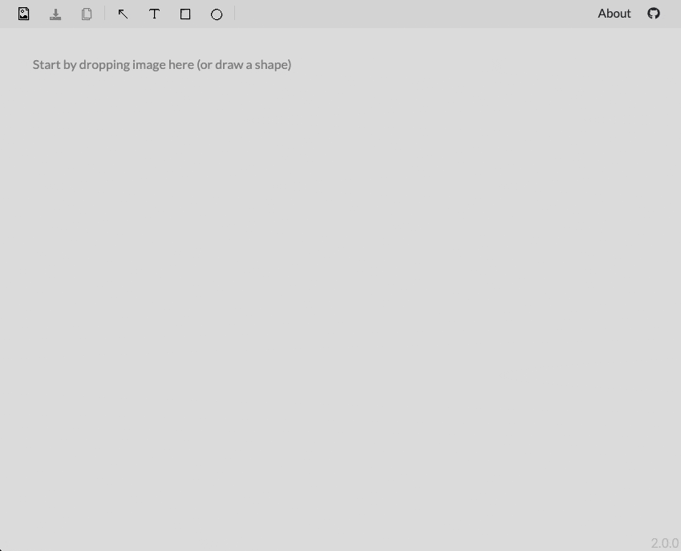

# Image review

[](https://travis-ci.org/artemdemo/imgreview)

Simple app for adding review to a screenshot.



## Documentation

It's stored separately - [open documentation](./documentation/README.md).

## Development

Just install packages:

```
$ npm install
```

And start

```
$ npm start
```

## Development with docker

Or you can develop in a docker.
All you need to do to start is to run following command:

```
$ docker-compose up
```

In order to stop you'll need:

```
$ docker-compose down
```

App will be available at http://localhost:8080/

In case you made some changes to `package.json` you'll need to rebuild it:

```
$ docker-compose up --build
```
