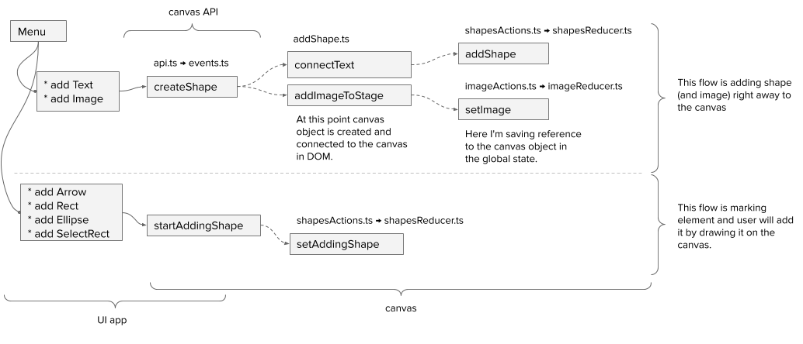

## Project documentation

### Architecture


### Create shape events flow



### Code structure

The main codebase is separated into 2 modules:

* `source` - main application interface: MainMenu, Popups, etc
* `srcCanvas` - canvas module, that exposes api

Both modules are independent and allowed to communicate only via public api. Reasoning:

* Clear code separation.
* Allows independent development by different teams.
* Make it easy to change main technology on either end:
    * At some point I can to decide to change canvas library in `srcCanvas`,
    and it will not affect main app in `source`.
* Canvas module can be loaded asynchronously, which decrease time to interaction and improves UX.

Both modules have separate redux state.

**Notice**, there is only one exception to the separation rule:

* `<CanvasEl />` - this component developed inside of `srcCanvas`, but used in `source`. Reasoning:
    * It's 100% related to functionality of the canvas.
    * It uses raw API of `konva` library

Full project structure:

```
.
+-- __mocks__/
+-- build/
+-- documentation/
|   +-- uml/
+-- jest/
+-- source/
|   +-- __mocks__/
|   +-- __tests__/
|   +-- components/
|   +-- containers/
|   +-- model/
|   +-- props/
|   +-- services/
|   +-- styles/
|   +-- views/
|   +-- index.ejs
|   +-- index.jsx
|   +-- reducers.ts
|   +-- store.js
+-- srcCanvas/
|   +-- __tests__/
|   +-- Arrow/
|   +-- CanvasEl/
|   +-- events/
|   +-- Image/
|   +-- model/
|   +-- Shape/
|   +-- addShape.ts
|   +-- api.ts
|   +-- drawImage.js
|   +-- reducers.ts
|   +-- store.ts
+-- types/
|   +-- konva.d.ts
+-- webpack/
```
